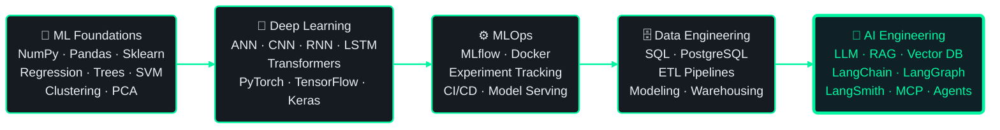

<!--
═══════════════════════════════════════════════════════════════════════════
  GITHUB PROFILE README  ·  Sajidur Rahman Siam  ·  @SajidurCodes
═══════════════════════════════════════════════════════════════════════════

  SETUP CHECKLIST — do these once, then delete this comment block:

  [ ] 1. This file must live in a repo named EXACTLY  SajidurCodes/SajidurCodes
         (repo name == username) and be PUBLIC, or nothing renders on your profile.

  [ ] 2. Search this file for "TODO" — there are project placeholders to fill in.

  [ ] 3. For the contribution-snake animation to work:
         - Add the workflow file  .github/workflows/snake.yml  (provided separately)
         - Go to  Settings > Actions > General > Workflow permissions
           and select  "Read and write permissions"  > Save
         - Run the workflow once manually (Actions tab > Generate Snake > Run workflow)

  [ ] 4. Confirm your LeetCode username is exactly  Sajidursiam  (case-sensitive!).
         If not, fix it in the "Problem Solving" section or delete that section.

  [ ] 5. SELF-HOSTING THE STATS CARDS — the permanent fix for broken/rate-limited
         analytics. The public instances are shared by millions of profiles and
         run out of GitHub API quota constantly. Your own instance gets its own
         5,000 requests/hour and basically never fails.

         a. Create a classic GitHub token: Settings > Developer settings >
            Personal access tokens > Tokens (classic) > Generate new.
            Scope needed: just  read:user  (add  repo  only if you want
            private-repo commits counted). Copy it.
         b. Fork  github.com/anuraghazra/github-readme-stats
            Fork  github.com/DenverCoder1/github-readme-streak-stats
         c. On vercel.com: Add New > Project > import each fork > Deploy.
         d. In each Vercel project: Settings > Environment Variables >
            add  PAT_1  = your token. Then Deployments > Redeploy.
         e. Swap the hostnames in the "GitHub Analytics" section below:
              github-readme-stats.vercel.app   -> your-stats-app.vercel.app
              nirzak-streak-stats.vercel.app   -> your-streak-app.vercel.app
            Keep every query parameter exactly as-is.
         f. With your own instance you can safely add back
            &include_all_commits=true&count_private=true  to the stats URL.

═══════════════════════════════════════════════════════════════════════════
-->

<div align="center">
  
</div>

<div align="center">
  <a href="https://github.com/SajidurCodes">
    
  </a>
</div>

<div align="center">
  <a href="https://github.com/SajidurCodes"></a>
  &nbsp;
  <a href="https://github.com/SajidurCodes?tab=followers"></a>
  &nbsp;
  <a href="mailto:sajidursiam18@gmail.com"></a>
</div>

<br />

---

## 👋 &nbsp; Who I Am

I build the parts of a product that have to **not fall over** — APIs, auth, data models, payment flows, error boundaries — and I've spent the last stretch layering AI on top of that foundation rather than treating it as a separate career.

My path into AI wasn't backwards. I started at **classical ML and the math**, moved through **deep learning architectures**, then **MLOps**, then **data engineering**, and only then into **AI/LLM engineering**. That order matters: when a RAG pipeline returns garbage, I debug it as a retrieval and evaluation problem, not by shuffling prompts and hoping.

```ts
const sajidur: Engineer = {
  base:          "Backend Engineering — Node.js · Express · TypeScript · PostgreSQL",
  frontend:      "Next.js (App Router, Server Actions, TanStack) · React · Tailwind · shadcn/ui",
  aiTrack:       "ML Foundations → Deep Learning → MLOps → Data Eng → AI Engineering",
  buildingNow:   ["RAG systems", "agentic workflows", "production REST APIs"],
  strongestAt:   "designing an API + schema that survives real traffic and real edge cases",
  lookingFor:    ["AI / ML Engineer", "AI Engineer (LLM)", "Full-Stack Engineer w/ ML"],
  openTo:        ["Remote", "Hybrid", "Onsite"],
  currentlyRTFM: "LangGraph state machines & agent evaluation",
};
```

<table>
<tr>
<td width="33%" valign="top" align="center">

**🔧 Where I'm Deep**

Backend architecture, relational data
modeling, auth & security flows,
API design that scales

</td>
<td width="33%" valign="top" align="center">

**🤖 Where I'm Building**

RAG pipelines, vector search,
LLM orchestration, agents,
AI-integrated services

</td>
<td width="33%" valign="top" align="center">

**🎨 Where I'm Solid**

Next.js app-router frontends,
dashboards, data tables,
React component work

</td>
</tr>
</table>

---

## 🌐 &nbsp; Reach Me

<div align="center">
  <a href="https://www.linkedin.com/in/sajidur-rahman-siam-17870b310"></a>
  <a href="mailto:sajidursiam18@gmail.com"></a>
  <a href="https://github.com/SajidurCodes"></a>
  <a href="https://www.kaggle.com/sajidursiam"></a>
  <a href="https://medium.com/@sajidursiam18"></a>
  <a href="https://x.com/SajidurSiamVai"></a>
</div>

---

## 🗺️ &nbsp; How I Got Into AI — The Actual Route



> Foundations first, buzzwords last. I can explain *why* a chunking strategy changes retrieval quality, not just which library call does it.

---

## 🛠️ &nbsp; Tech Arsenal

<div align="center">

**Languages**


**Backend & Runtime**


**Databases**


**Frontend**


**AI · ML · Data Science**


**DevOps · Cloud · Tooling**


</div>

<div align="center">

<br />


<br />


<br />


<br />


</div>

---

## 🧠 &nbsp; What I Can Actually Do

<table>
<tr>
<td width="50%" valign="top">

### ⚙️ Backend Engineering &nbsp;`primary`

- Layered architecture — route → controller → service → data
- Modular, multi-domain project structure that scales past 50 endpoints
- Node.js internals: event loop, streams, buffers, ESM ⇄ CommonJS
- REST API design, versioning, consistent response envelopes
- **Auth & security:** JWT access + refresh rotation, bcrypt hashing, role-based access control, OTP email verification, password reset, Google OAuth, CORS & trusted origins
- **Validation:** Zod schemas as middleware, typed request contracts
- **Error architecture:** custom error classes, global error middleware, ORM error mapping, 404 handling
- **Process resilience:** `uncaughtException`, `unhandledRejection`, `SIGTERM` / `SIGINT` graceful shutdown
- Reusable query builder — search, filter, sort, paginate, field selection, dynamic relation includes
- File uploads via Multer → Cloudinary, with cleanup
- Stripe checkout + webhook handling, idempotent payment state
- Cron jobs for scheduled/auto-expiring workflows
- Transactional writes, server-side PDF generation, transactional email

</td>
<td width="50%" valign="top">

### 🤖 AI / LLM Engineering &nbsp;`growth track`

- **LLM app architecture:** prompt templates, structured JSON output, response streaming, retry & backoff, token budgeting, call logging and monitoring
- **RAG pipelines:** document cleaning, chunking strategy, embedding generation, retrieval, context injection, source grounding to cut hallucination, multi-step RAG, retrieval-relevance evaluation
- **Vector search:** pgvector in PostgreSQL, index tuning, hybrid keyword + semantic search, embedding optimisation at scale
- **LangChain:** chains, prompt templates, output parsers, memory & conversation state, tools
- **LangGraph:** stateful graphs for multi-step and branching agent workflows
- **LangSmith:** tracing, debugging chains, evaluating agent behaviour
- **MCP:** exposing tools and context to models via Model Context Protocol
- **Agents:** tool use, planning loops, autonomous multi-step task execution
- **Fine-tuning:** dataset prep, OpenAI fine-tune jobs, LoRA / QLoRA, evaluation, and knowing when RAG beats fine-tuning
- **Chat systems:** conversation history, system prompts, role-based personas, streaming into Next.js
- **Automation:** self-hosted n8n on Docker, agentic multi-step flows, Slack / email / CRM integration

</td>
</tr>
<tr>
<td width="50%" valign="top">

### 🗄️ Databases & Data Modeling

- PostgreSQL — advanced SQL, all join types, aggregates, `COALESCE`, `GROUP BY … HAVING`
- ER modeling, cardinality, super / candidate / composite / foreign keys
- Normalization 1NF → 3NF, anomaly resolution, junction tables
- **Prisma ORM:** schema design, migrations, relations & enums, self-relations, indexing & mapping, multi-file schema, transactions, upsert
- Offset **and** cursor-based pagination with metadata
- Query optimisation fundamentals, seeding strategies
- pgvector for embedding storage and similarity search
- Also worked with MongoDB, MySQL, Supabase, Neon serverless Postgres

### 🧮 ML & Deep Learning

- Supervised, unsupervised & reinforcement learning concepts
- Feature engineering, preprocessing, train/val/test discipline
- Model evaluation, metric selection, overfitting diagnosis
- Deep learning architectures and training loops
- NLP and text processing, transformer intuition
- NumPy · Pandas · Matplotlib · Scikit-learn · TensorFlow · Keras · PyTorch

</td>
<td width="50%" valign="top">

### 🎨 Frontend — Next.js & React

- App Router: file-system routing, route groups, **parallel routes**, nested and role-based layouts
- Server Components & **Server Actions**, client/server boundary discipline
- Caching strategy: SSG · ISR · SSR + **on-demand revalidation**
- Route protection via proxy/middleware, cookie sessions, refresh-token rotation on the client
- **TanStack Query** with prefetch + dehydrate/hydrate, **TanStack Table**, **TanStack Form**
- Reusable data tables — server-driven sort, filter, search, pagination, action columns, status badges
- Dashboards: stats cards, bar & pie charts, dynamic role-based sidebars, icon mappers
- Type-safe environment validation, typed Axios HTTP client layer
- Tailwind CSS + shadcn/ui, dark mode without hydration errors
- React fundamentals: hooks, composition, reusable custom hooks

### 🔷 TypeScript Depth

- Generics, generic constraints, `keyof` constraints
- Conditional types, mapped types, utility types
- Interfaces, type aliases, union & intersection, literal types
- Type guards — `typeof`, `in`, `instanceof`, discriminated unions
- OOP: classes, inheritance, polymorphism, abstraction, encapsulation, access modifiers, getters/setters, statics

</td>
</tr>
<tr>
<td colspan="2" valign="top">

### 🚀 DevOps, Cloud & Testing

<table>
<tr>
<td width="33%" valign="top">

**Containers & Cloud**

- Docker & containerised services
- AWS — EC2, S3, IAM
- Linux — permissions, processes, utilities
- NGINX reverse proxy & deployment

</td>
<td width="33%" valign="top">

**CI/CD & Delivery**

- GitHub Actions pipelines
- Automated build → test → deploy
- Environment-based configuration
- Vercel deployments

</td>
<td width="33%" valign="top">

**Testing & Quality**

- Unit & integration testing
- Advanced mocking techniques
- REST API testing — Vitest + Supertest
- Software design & architecture fundamentals

</td>
</tr>
</table>

</td>
</tr>
</table>

---

## 🚀 &nbsp; Featured Projects

<!-- ─────────────────────────────────────────────────────────────────────
  TODO — HOW TO FILL THIS IN (takes ~5 minutes):

  For each project below, replace THREE things:
    1. REPO-NAME-1   →  the exact repo name, e.g. healthcare-appointment-api
    2. The project title in the h3 heading
    3. The description line and the tech badges

  Then delete any card you don't need, and delete the "coming soon" card.

  The  is a live GitHub repo card — it auto-pulls stars, forks and
  description, so it stays current with zero maintenance.
  A repo card ONLY renders if the repo is public and the name is exact.
───────────────────────────────────────────────────────────────────────── -->

<table>
<tr>
<td width="50%" valign="top">

<h3 align="center">🏥 TODO: Project One Title</h3>

<div align="center">
  <a href="https://github.com/SajidurCodes/REPO-NAME-1">
    
  </a>
</div>

**TODO:** One sentence on what it does and the hardest problem you solved — recruiters read this line, so lead with impact, not features.

<div align="center">
  
  
  
  
</div>

<div align="center">
  <a href="https://github.com/SajidurCodes/REPO-NAME-1"></a>
  <a href="#"></a>
</div>

</td>
<td width="50%" valign="top">

<h3 align="center">🤖 TODO: Project Two Title</h3>

<div align="center">
  <a href="https://github.com/SajidurCodes/REPO-NAME-2">
    
  </a>
</div>

**TODO:** If you have an AI/RAG project, put it here — this is the slot an AI-role recruiter looks at first. Mention the retrieval approach and any measurable result.

<div align="center">
  
  
  
  
</div>

<div align="center">
  <a href="https://github.com/SajidurCodes/REPO-NAME-2"></a>
  <a href="#"></a>
</div>

</td>
</tr>
<tr>
<td width="50%" valign="top">

<h3 align="center">🧠 TODO: Project Three Title</h3>

<div align="center">
  <a href="https://github.com/SajidurCodes/REPO-NAME-3">
    
  </a>
</div>

**TODO:** A good third slot is an ML/data project — dataset, model, and the metric you got. Numbers beat adjectives.

<div align="center">
  
  
  
</div>

<div align="center">
  <a href="https://github.com/SajidurCodes/REPO-NAME-3"></a>
  <a href="#"></a>
</div>

</td>
<td width="50%" valign="top">

<h3 align="center">🌐 TODO: Project Four Title</h3>

<div align="center">
  <a href="https://github.com/SajidurCodes/REPO-NAME-4">
    
  </a>
</div>

**TODO:** Use this slot for a full-stack product with a live URL. A working deployed link converts better than any README section.

<div align="center">
  
  
  
  
</div>

<div align="center">
  <a href="https://github.com/SajidurCodes/REPO-NAME-4"></a>
  <a href="#"></a>
</div>

</td>
</tr>
</table>

<div align="center">
  <a href="https://github.com/SajidurCodes?tab=repositories"></a>
</div>

---

## 🧩 &nbsp; What I Build

```txt
Backend Systems     →  REST APIs, layered architecture, auth & RBAC, payments, file pipelines
AI Applications     →  Chat assistants, summarizers, document intelligence, AI-powered tools
RAG Systems         →  Document QA, semantic + hybrid search, knowledge-grounded generation
AI Agents           →  Tool-using agents, multi-step planning, LangGraph state machines
ML Systems          →  Preprocessing, training, evaluation, deployment-ready models
Data Systems        →  Relational modeling, ETL-style workflows, analytics-ready schemas
Full-Stack Products →  Next.js + Node/Express + PostgreSQL + Prisma, deployed and monitored
Automations         →  n8n workflows, cron jobs, webhook-driven background processing
```

---

## 📊 &nbsp; GitHub Analytics

<div align="center">
  
  
</div>

<br />

<div align="center">
  <!-- Using the nirzak mirror because streak-stats.demolab.com is currently
       rate-limited. If this one also fails, the permanent fix is self-hosting —
       see the SELF-HOSTING note in the checklist at the top of this file.
       Original host, kept as a fallback to swap back to:
       https://streak-stats.demolab.com?user=SajidurCodes&theme=tokyonight&... -->
  
</div>

<br />

<div align="center">
  
</div>

---

## 🐍 &nbsp; Watch My Commits Get Eaten

<div align="center">
  <picture>
    <source media="(prefers-color-scheme: dark)" srcset="https://raw.githubusercontent.com/SajidurCodes/SajidurCodes/output/snake-dark.svg" />
    <source media="(prefers-color-scheme: light)" srcset="https://raw.githubusercontent.com/SajidurCodes/SajidurCodes/output/snake.svg" />
    
  </picture>
</div>

<!-- If the snake shows a broken image: the workflow hasn't run yet.
     Actions tab > "Generate Snake Animation" > Run workflow.
     Also confirm Settings > Actions > General > "Read and write permissions". -->

---

## 🧮 &nbsp; Problem Solving

<div align="center">
  <!-- LeetCode usernames are case-sensitive. If this card is blank,
       your handle is wrong — check leetcode.com/u/<handle>/ and fix it here. -->
  
</div>

---

## 🎯 &nbsp; Right Now

<table>
<tr>
<td width="50%" valign="top">

### 📚 Learning

- LangGraph — stateful, branching agent graphs
- Agent evaluation & observability with LangSmith
- MCP servers for tool-augmented models
- Advanced RAG — reranking, query rewriting, hybrid retrieval
- MLOps: model registries, drift monitoring
- Deeper data engineering & pipeline orchestration

</td>
<td width="50%" valign="top">

### 🔨 Building

- RAG-based knowledge assistants over private documents
- Agentic workflows that call real tools, not just chat
- Production-grade REST APIs with full auth & error architecture
- Next.js dashboards on top of my own backends
- ML projects with honest evaluation, not just notebooks

</td>
</tr>
</table>

<div align="center">

<br />


</div>

---

## ✍️ &nbsp; Signing Off

<div align="center">
  <i>"My life is like a Christopher Nolan movie — confusing at first, but somehow it all comes together."</i> 😅
  <br /><br />
  
</div>

<div align="center">
  
</div>
